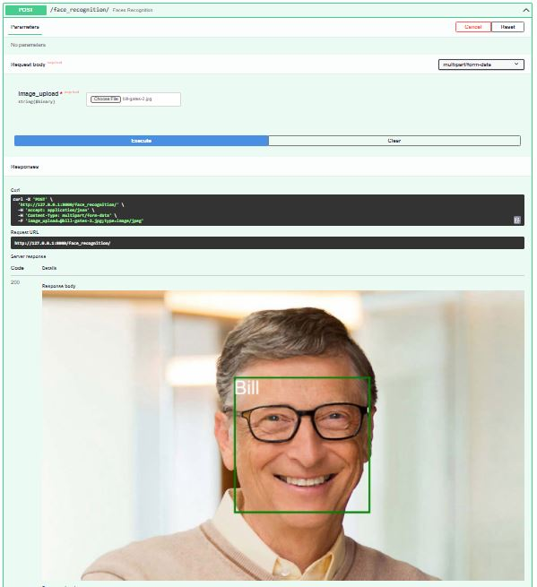

<<<<<<< HEAD
# Face Recognition and Attendance System
- FastAPI, OpenCV, python

Register faces by uploading image containing face you want the model to recognize and a add name


After the faces have been registered, the model can then recognize face of a person



## Usage
Run using below command to start FastAPI

```
uvicorn FaceRecognition-FastAPI:app --reload
```

## Recognize faces based on the registered faces and then add a person name and time (Attendance System)

Run using below command to start 

```
python RealTimeFaceRecognition_AttendanceSystem.py
```
